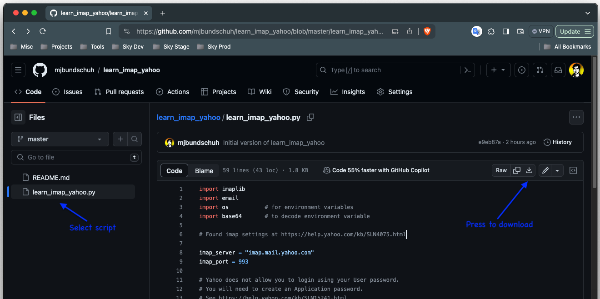
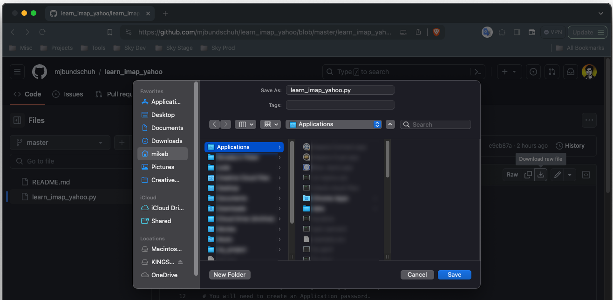

# learn_sort_speed.py

Simple python script to compare search speeds for Sets, Dictionarys, Lists and binary search

## Installation

### 1. Download the script and names file

* Go to [https://github.com/mjbundschuh/learn_sort_speed] 
* Select the script
* Select the download button



* Select a destination. 



* Repeat for the names.txt file

_In this example, I chose my $HOME/Applications folder to store the script. This folder is in my $PATH_

### 2. Run the script

Go to your Applications folder and run python on the script

```zsh
% cd ~/Applications
% python learn_sort_speed.py

set search speed: average 5000x
    good list: 0.0005
     bad list: 0.0004

dict search speed: average 5000x
    good list: 0.0004
     bad list: 0.0004

bsearch search speed: average 5000x
    good list: 0.0099
     bad list: 0.0111

list search speed: average 5000x
    good list: 0.2449
     bad list: 0.5192

```

## Learning Notes
* Sets and Dictionaries are extremely fast and was 20x or more faster than binary search
* Lists are slower by 2 orders of magnitude / 1000x than Sets or Dictionaries
* Indentation is important in python (OMG shades of COBOL?)

## Testing and Assumptions

* This program was tested on a Macbook Air using iTerm2 (a better alternative to the terminal)
* You should be using Python3 and it should be in your PATH when you run this program
* You know how to use a terminal and command-line commands
* names.txt database started with first name data from Data World, then supplemented with additional names (mostly non-European). It has 7000+ first names.

```zsh
% cd ~/Applications
% head -n 15 names.txt
Aaden
Aaliyah
Aarav
Aaron
Aarthi
Aarthy
Ab
Abagail
Abb
Abbey
Abbie
Abbigail
Abbott
Abby
Abdiel
% cat names.txt | wc -l
    7069
```

## Supporting Documentation

* [Python Sets](https://realpython.com/python-sets/)
* [Python Lists](https://realpython.com/python-list/#appending-a-single-item-at-once-append)
* [Data World - Names](https://data.world/alexandra/baby-names)
* [Using __name__ in main](https://stackoverflow.com/questions/419163/what-does-if-name-main-do#419185)

## License

[MIT](https://choosealicense.com/licenses/mit/)
